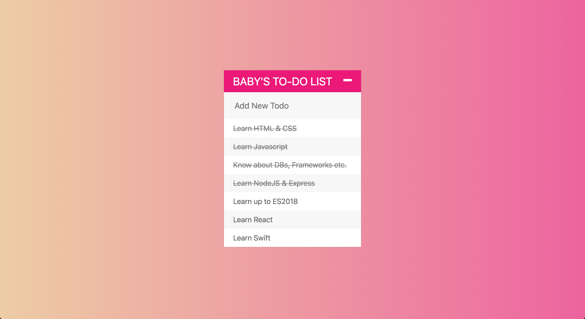

# todo_api

Todo list API with CRUD functionality. Running on NodeJS, Express, MongoDB.

## Getting Started

These instructions will get you a copy of the project up and running on your local machine for development and testing purposes. See running locally for notes on how to deploy the server locally on your machine. (Note: currently instructions are not 100% accurate)

### Prerequisites

1. [Git](https://git-scm.com/book/en/v2/Getting-Started-Installing-Git)
1. [Node](https://nodejs.org/en/)
1. MongoDB: See [MongoDB Installation Documentation](https://docs.mongodb.com/manual/installation/)
1. Yarn: See [Yarn website for installation instructions](https://yarnpkg.com/lang/en/docs/install/)
1. A fork of the repo (for any contributions)
1. A clone of the [todo_api](https://github.com/KyruCabading/todo_api) on your local machine

### Installation

1. `cd todo_api` to go into the project root
1. `yarn` to install the websites npm dependencies

### Running locally

1. `cd todo_api` to go into the project root
1. `mongod` in a separate terminal window to start your database
1. `node index.js` to start the node server.
1. open http://localhost:3000 to open the site in your favorite browser

## Built With

* [mongoDB](https://www.mongodb.com/) - database
* [express](https://expressjs.com/) - web application framework
* [node](https://nodejs.org/en/) - server framework
* [Bootstrap](https://getbootstrap.com/) - css framework
* [Passport.js](http://www.passportjs.org/) - authentication framework
* [body-parser](https://www.npmjs.com/package/body-parser) - body parsing middleware

## Contributing

#### Create a branch

1. `git checkout master` from any folder in your local `node_api` repository
1. `git pull origin master` to ensure you have the latest main code
1. `git checkout -b the-name-of-my-branch` (replacing `the-name-of-my-branch` with a suitable name) to create a branch

## Authors

* **[KyruCabading](https://github.com/KyruCabading)** 
